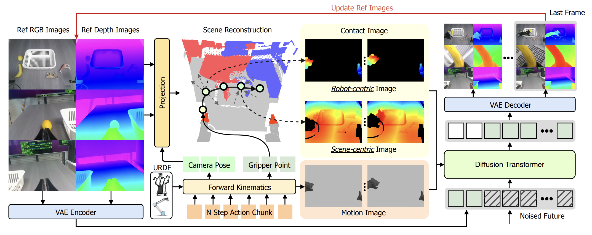

# iMac: Translating Actions into Motion and Contact Images for Embodied World Models
### [Project Page](https://imac-wm.github.io/) | [Data](https://huggingface.co/datasets/open-gigaai/CVPR-2026-WorldModel-Track-Dataset)


## Method 

Method Pipeline:


## Demo

World model as evaluator:


## Repository Layout

This repository contains the training, preprocessing, and inference code for
three iMaC workflows:

1. RND-mix stage-one training and evaluation.
2. RND-mix stage-two training and evaluation with replay and 3D conditions.
3. WorldArena preprocessing, 3D-condition training, and validation inference.

This README is the reproducible entry point for running the released code.


```text
iMac/
  configs/       Training configurations
  models/        Wan transformer variants
  pipelines/     Diffusion inference pipelines
  trainer/       RND-mix and WorldArena trainers
  transforms/    Dataset transforms
scripts/
  launch_train.py
  inference_rnd_mix_stage_one.py
  inference_rnd_mix_stage_two.py
  inference_worldarena_val.py
  process_depth_da3_worldarena.py
  process_depth_da3_worldarena_testdata.py
  process_3d_condition.py
  process_3d_condition_worldarena_testdata.py
third_party/
  giga-train/
  giga-datasets/
  giga-models/
```

## Installation

The code targets Python 3.11 and CUDA-capable PyTorch.

```bash
conda create -n giga_torch python=3.11.10
conda activate giga_torch

pip install -e third_party/giga-train
pip install -e third_party/giga-datasets
pip install -e third_party/giga-models
```

Install the remaining runtime dependencies used by your workflow, including
PyTorch, Diffusers, Accelerate, Decord, OpenCV, ImageIO, HDF5, Blosc, SciPy,
Trimesh, Robotics Toolbox, and the `depth_anything_3` package.

For online RND evaluation, install RobotWin 2.0 separately and configure the
simulator assets required by `simulator/script/run_simulator_server.py`.

## Path Configuration

No user-specific absolute path is required by the released configs. Set paths
with environment variables:

```bash
export CVPR2026_WM_DATA_DIR=/path/to/CVPR-2026-WorldModel-Track-Dataset
export CVPR2026_WM_MODEL_CACHE=/path/to/pretrained_models
export CVPR2026_WM_OUTPUT_DIR=/path/to/outputs

export DA3_MODEL_PATH=/path/to/DA3/model
export PIPER_URDF_PATH=/path/to/piper.urdf
export PIPER_GRIPPER_MESH_DIR=/path/to/piper/meshes
```

Optional variables:

| Variable | Purpose | Default |
| --- | --- | --- |
| `CVPR2026_WM_PROMPT_EMBEDDING` | Prompt embedding used by WorldArena | `asserts/default_prompt_embeds.pth` |
| `RND_MIX_STAGE_ONE_OUTPUT_DIR` | Stage-one experiment directory | `$CVPR2026_WM_OUTPUT_DIR/rnd_mix_stage_one_alltask` |
| `RND_MIX_STAGE_TWO_OUTPUT_DIR` | Stage-two experiment directory | `$CVPR2026_WM_OUTPUT_DIR/rnd_mix_stage_two_alltask` |
| `RND_MIX_STAGE_ONE_CHECKPOINT` | Stage-one transformer used to initialize stage two | no default; required for stage two |
| `WORLDARENA_DATA_DIR` | WorldArena root containing `train/` and `val/` | `data/WorldArena` |
| `WORLDARENA_OUTPUT_DIR` | WorldArena experiment directory | `$CVPR2026_WM_OUTPUT_DIR/worldarena_3d` |
| `WORLDARENA_URDF_PATH` | WorldArena robot URDF | falls back to `PIPER_URDF_PATH` |
| `WORLDARENA_GRIPPER_MESH_DIR` | WorldArena robot meshes | falls back to `PIPER_GRIPPER_MESH_DIR` |
| `TORCH_MP_SHARING_STRATEGY` | PyTorch multiprocessing sharing mode | `file_descriptor` |

See `.env.example` for a complete template. Model paths in
`iMac/model_config.py` are resolved under
`CVPR2026_WM_MODEL_CACHE`.

Download the configured pretrained models with:

```bash
python scripts/download_pretrained_models.py
python scripts/download_gigabrain_policy.py
```

## Dataset Preparation

### CVPR World Model Dataset

Download the dataset and pack the training split:

```bash
python scripts/pack_training_data.py \
  --data_dir "$CVPR2026_WM_DATA_DIR" \
  --task all
```

RND-mix expects three synchronized RGB videos, three DA3 metric-depth videos,
simulator replay videos, and qpos. DA3 depth videos are `uint16` millimeters;
the transform converts them back to meters before normalization.

The RND-mix configs use:

```text
num_frames = sub_frames * rollout + 1 = 8 * 4 + 1 = 33
depth range = [0.08, 1.2] meters
depth RGB encoding = vision_banana
```

### WorldArena

The packed WorldArena samples used for training and validation must contain:

```text
gt_video_path
condition_video_path
scene_3d_condition_path
replay_3d_condition_path
task_name
episode_name
```

Generate the reference depth:

```bash
python scripts/process_depth_da3_worldarena.py \
  --data_root_path "$WORLDARENA_DATA_DIR/train" \
  --device cuda:0 \
  --da3_model_path "$DA3_MODEL_PATH" \
  --urdf_path "$WORLDARENA_URDF_PATH" \
  --gripper_mesh_dir "$WORLDARENA_GRIPPER_MESH_DIR" \
  --only_ref_frame
```

Generate replay and scene 3D-condition videos:

```bash
python scripts/process_3d_condition.py \
  --data_root "$WORLDARENA_DATA_DIR/train" \
  --robot_type agilex \
  --urdf "$WORLDARENA_URDF_PATH" \
  --mesh_dir "$WORLDARENA_GRIPPER_MESH_DIR"
```

Repeat both commands for `val/` when validation samples have not been
preprocessed.

## RND-Mix Stage One

Stage one trains on vertically stacked RGB and metric-depth frames. Replay
images are the only condition branch.

### Train

```bash
python scripts/launch_train.py --preset baseline_rnd_mix_stage_one_alltask
```

The main config is:

```text
iMac/configs/
  baseline_wm_rnd_mix_stage_one_alltask.py
```

### Offline Test

```bash
python scripts/inference_rnd_mix_stage_one.py \
  --transformer_model_path /path/to/stage_one/checkpoint/transformer \
  --device_list 0 \
  --mode offline \
  --task task1 \
  --data_dir "$CVPR2026_WM_DATA_DIR" \
  --output_dir "$CVPR2026_WM_OUTPUT_DIR/rnd_mix_stage_one_eval"
```

The inference defaults match the released training config:
`vision_banana`, depth range `[0.08, 1.2]`, and square-root normalization.

## RND-Mix Stage Two

Stage two initializes from stage one and adds `replay_3d_condition` and
`scene_3d_condition`. The replay image branch remains active.

### Train

```bash
export RND_MIX_STAGE_ONE_CHECKPOINT=/path/to/stage_one/checkpoint/transformer

python scripts/launch_train.py --preset baseline_rnd_mix_stage_two_alltask
```

The main config is:

```text
iMac/configs/
  baseline_wm_rnd_mix_stage_two_alltask.py
```

Stage-two 3D-condition generation needs the Piper URDF and mesh paths even
when DA3 loading is disabled, because robot forward kinematics is still used.

### Offline Test

```bash
python scripts/inference_rnd_mix_stage_two.py \
  --transformer_model_path /path/to/stage_two/checkpoint/transformer \
  --device_list 0 \
  --mode offline \
  --task task1 \
  --data_dir "$CVPR2026_WM_DATA_DIR" \
  --output_dir "$CVPR2026_WM_OUTPUT_DIR/rnd_mix_stage_two_eval" \
  --da3_model_path "$DA3_MODEL_PATH" \
  --da3_urdf_path "$PIPER_URDF_PATH" \
  --da3_gripper_mesh_dir "$PIPER_GRIPPER_MESH_DIR"
```

Use `--max_episodes N` for a smoke test. Existing non-empty episode videos are
skipped by default; pass `--no-skip_existing` to regenerate them.

### Online Test

Start the simulator server:

```bash
python simulator/script/run_simulator_server.py \
  --host_port 9151 \
  --save_tag sim9151
```

Then run:

```bash
python scripts/inference_rnd_mix_stage_two.py \
  --transformer_model_path /path/to/stage_two/checkpoint/transformer \
  --device_list 0 \
  --mode online \
  --task task1 \
  --policy_ckpt_dir /path/to/policy \
  --policy_norm_stats_path /path/to/policy/norm_stat_gigabrain.json \
  --simulator_ip 127.0.0.1 \
  --simulator_port 9151 \
  --output_dir "$CVPR2026_WM_OUTPUT_DIR/rnd_mix_stage_two_online"
```

## WorldArena 3D

The released configuration is:

```text
iMac/configs/0501_worldarena_3d_r1c120.py
```

It trains `WorldArena3DTrainer` with replay-image, scene-3D, and replay-3D
conditions.

### Train

```bash
python scripts/launch_train.py --preset worldarena_3d
```

### Validation Inference

```bash
python scripts/inference_worldarena_val.py \
  --transformer_model_path /path/to/worldarena/checkpoint/transformer \
  --config_path iMac.configs.0501_worldarena_3d_r1c120.config \
  --dataset_dir "$WORLDARENA_DATA_DIR/val" \
  --save_dir "$CVPR2026_WM_OUTPUT_DIR/worldarena_val" \
  --gpu_ids 0
```

Use `--episodes 40,41,49` to evaluate selected episodes.

### Test-Set Inference

For the official test layout with `first_frame/fixed_scene_task/*.png`, use
the testdata preprocessors:

```bash
python scripts/process_depth_da3_worldarena_testdata.py \
  --data_root_path /path/to/worldarena_test \
  --device cuda:0 \
  --da3_model_path "$DA3_MODEL_PATH" \
  --urdf_path "$WORLDARENA_URDF_PATH" \
  --gripper_mesh_dir "$WORLDARENA_GRIPPER_MESH_DIR"

python scripts/process_3d_condition_worldarena_testdata.py \
  --data_root /path/to/worldarena_test \
  --robot_type agilex \
  --urdf "$WORLDARENA_URDF_PATH" \
  --mesh_dir "$WORLDARENA_GRIPPER_MESH_DIR"
```

Then run:

```bash
python scripts/inference_worldarena_test.py \
  --transformer_model_path /path/to/worldarena/checkpoint/transformer \
  --config_path iMac.configs.0501_worldarena_3d_r1c120.config \
  --dataset_paths /path/to/worldarena_test \
  --save_dir "$CVPR2026_WM_OUTPUT_DIR/worldarena_test" \
  --gpu_ids 0
```

## Validation

The repository has no root unit-test suite. Before a full training run:

```bash
python -m compileall \
  iMac \
  scripts \
  scripts/process_depth_da3_worldarena.py \
  scripts/process_3d_condition.py

python scripts/launch_train.py --help
python scripts/inference_rnd_mix_stage_one.py --help
python scripts/inference_rnd_mix_stage_two.py --help
python scripts/inference_worldarena_val.py --help
```

For config changes, verify that:

- `num_frames = sub_frames * rollout + 1`.
- Stage-two depth encoding matches stage one.
- `RND_MIX_STAGE_ONE_CHECKPOINT` resolves to a transformer directory.
- WorldArena samples include all three condition paths.
- qpos samples stay aligned with video/depth samples.
